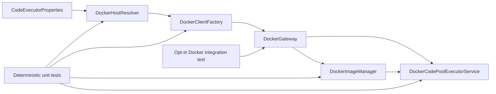

# Backend Clean Code Design

## 1. Goal

Improve the backend and its tests without changing frontend code or intended business
behavior. The first priority is making tests trustworthy: tests must fail for the defect
they claim to detect, must not silently skip assertions, and must not depend on an
accidentally available local service.

The work starts from `main` at commit `af5438d` on branch
`codex/backend-clean-code`.

## 2. Current Evidence

- The backend contains 295 production Java files and 158 test files.
- Checkstyle and Spring Java Format validation pass.
- A baseline run completed 1,438 tests with no assertion failures before hanging in
  `DockerCodePoolExecutorServiceTest`.
- `DockerCodePoolExecutorServiceTest` constructs a real Docker client, conditionally
  returns without assertions when construction fails, and uses reflection to test private
  methods.
- `DockerCodePoolExecutorService` is 459 lines and combines environment detection,
  client construction, image preparation, container lifecycle, file transfer, and command
  execution.
- Compilation reports Lombok builder-default warnings in `HybridSearchRequest` and
  `ModelConfigDTO`.
- The production tree contains broad `Exception` catches in 46 files. These are candidates,
  not a mandate for mechanical replacement.

## 3. Scope

### Included

1. Make the default backend test suite deterministic and independent of a real Docker
   daemon.
2. Replace tests that can silently pass with behavior-focused tests.
3. Add positive/negative and boundary comparison cases for changed behavior.
4. Refactor backend collaborators where testability exposes mixed responsibilities.
5. Fix compiler warnings whose behavior can be specified by tests.
6. Continue through backend hotspots ranked by complexity, business risk, and test
   weakness.

### Excluded

- Any file under `data-agent-frontend`.
- Product feature changes.
- Public API changes unless required to correct an independently demonstrated defect.
- Mechanical replacement of every broad exception catch.
- Large package restructuring unrelated to a tested design problem.

## 4. Test Trust Model

Every changed behavior follows a red-green-refactor cycle:

1. Write a focused test for the intended observable behavior.
2. Run it against the current implementation and confirm the expected failure.
3. Implement the smallest production change.
4. Run the focused test and its neighboring test class.
5. Refactor only while the tests remain green.
6. For regression-critical behavior, temporarily restore the old behavior or inject the
   known fault and confirm the test becomes red before restoring the fix.

Tests must follow these rules:

- No conditional `return` that skips the assertion path.
- No assertion that accepts every non-null exception message.
- No real network, Docker, filesystem, clock, or database dependency in a unit test.
- Prefer state and returned-value assertions over mock invocation counts.
- Use fakes for deterministic domain behavior and mocks only at narrow I/O boundaries.
- Do not use reflection to test private methods. Extract behavior into a collaborator with
  a package-visible or public contract when it deserves direct tests.
- Pair success and failure cases, plus boundary cases where the domain has a meaningful
  boundary.
- Real Docker and database checks are explicit integration tests, separated from the
  default unit-test lifecycle and skipped only through a visible tag/profile decision.

## 5. Backend Design Principles

- **Single responsibility:** environment resolution, Docker client creation, image
  preparation, and task execution belong to separate components.
- **Dependency inversion:** orchestration depends on a small Docker gateway contract rather
  than constructing infrastructure inside the service.
- **Explicit side effects:** constructors assign dependencies; they do not connect, pull
  images, or start long-running work.
- **Fail-fast contracts:** invalid configuration is rejected with a specific exception and
  testable message.
- **Encapsulation:** extract a collaborator only when it represents a coherent policy or
  external boundary, not merely to reduce line count.
- **Compatibility:** preserve current service interfaces and configuration properties while
  moving implementation details behind collaborators.

## 6. Proposed Structure

The exact number of collaborators will be kept minimal. If an existing Docker library type
already provides a sufficient boundary, it will be injected directly instead of adding an
extra wrapper.

## 7. Work Sequence

### Phase 1: Reliable test baseline

- Classify Docker tests into pure policy tests, orchestration unit tests, and real Docker
  integration tests.
- Remove conditional-pass and reflection-based tests.
- Ensure the default suite completes without Docker.
- Record baseline test count, duration, failures, and skipped tests.

### Phase 2: Testability-driven Docker refactor

- Extract host-resolution policy.
- Inject Docker client creation and image preparation.
- Remove external I/O from constructors.
- Test success, unavailable-daemon, missing-image, pull-failure, local-host, remote-host,
  and shutdown behavior with deterministic doubles.

### Phase 3: Warning-backed behavior fixes

- Add comparison tests for DTO construction through constructors and Lombok builders.
- Add `@Builder.Default` only where the tested contract requires builder defaults.
- Recompile and verify the warnings are removed.

### Phase 4: Ranked backend hotspots

Re-scan after the reliable baseline. Candidate work is selected using:

| Signal | Weight |
|---|---:|
| Test can pass without exercising behavior | Critical |
| External dependency in default unit test | Critical |
| Constructor performs I/O or starts work | High |
| Class mixes independent responsibilities | High |
| Compiler warning indicates behavioral ambiguity | High |
| Broad exception catch loses actionable semantics | Medium |
| Size alone | Low |

Each selected hotspot gets a separate red-green-refactor cycle. `SchemaServiceImpl`,
`DatasourceServiceImpl`, `GraphServiceImpl`, and code-executor classes are candidates, not
automatically approved rewrites.

## 8. Verification

The final branch must provide fresh evidence for:

1. Focused red-green evidence for every corrected behavior.
2. Default backend tests completing without a running Docker daemon.
3. Explicit Docker integration tests remaining available.
4. `./mvnw spring-javaformat:validate checkstyle:check` passing.
5. Backend compilation without the targeted Lombok builder warnings.
6. No changes under `data-agent-frontend`.
7. Git diff containing only intentional backend, test, and design/plan changes.

## 9. Commit Discipline

Commits are narrow and behavior-oriented:

1. Design and implementation plan.
2. Deterministic Docker test boundary.
3. Docker production refactor.
4. Builder-default behavior and warnings.
5. Each additional hotspot independently.

Existing user or environment changes to `CLAUDE.md` and `AGENTS.md` are excluded from all
commits.
